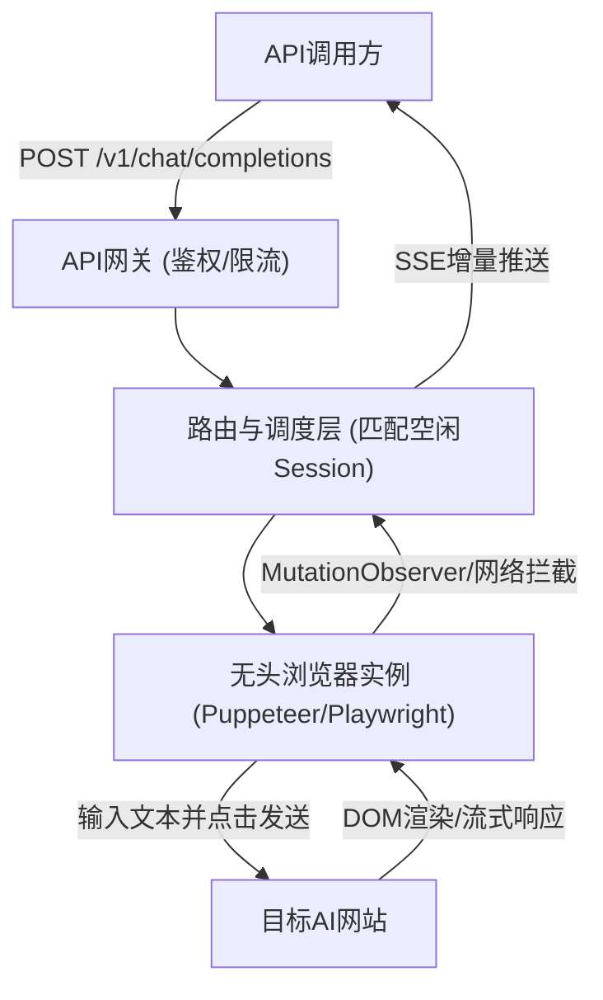

## 1. 产品概述
2api是一个轻量级、自托管的公网AI模型转化平台，能将任何带有模型的网站转化成兼容OpenAI标准的RESTful API。
- 解决问题：打破各大AI Web端的信息孤岛，让无官方API或API昂贵的网站也能被程序化调用。
- 核心价值：极其轻量化设计，能在1C1G（1核1G内存）的小型服务器上流畅运行。

## 2. 核心功能

### 2.1 用户角色
| 角色 | 注册方式 | 核心权限 |
|------|----------|----------|
| 管理员 | 初始安装配置 | 登记目标站点、配置会话池、查看调用日志、获取API Key |
| API调用方 | 无界面 | 仅通过API Key调用生成的RESTful API接口 |

### 2.2 功能模块
1. **控制台首页**：系统状态看板，展示当前API调用量、活跃会话数、成功率。
2. **站点与会话管理页**：登记目标AI网站，录入Cookie/账号信息，维持会话池存活。
3. **API密钥管理页**：生成、吊销和管理对外的API Key，查看调用额度。
4. **API网关模块 (无头)**：核心后台服务，处理鉴权、请求路由与限流。

### 2.3 页面详情
| 页面名称 | 模块名称 | 功能描述 |
|----------|----------|----------|
| 控制台首页 | 数据看板 | 实时展示系统的QPS、API成功率、错误日志 |
| 站点管理页 | 目标站点列表 | 添加新站点配置，包含URL、认证方式、解析模板等 |
| 会话管理页 | 会话池配置 | 填入网站的Cookie/Token，监控各个Session的有效性 |
| API密钥页 | Key列表 | 列表展示所有的API Key及其消耗的调用次数，支持一键吊销 |

## 3. 核心流程
用户在站点管理添加目标网站 -> 在会话管理填入有效的Cookie -> 平台通过无头浏览器加载网页并建立SSE连接 -> 外部调用 `/v1/chat/completions` -> 平台路由到对应的Session -> 在无头浏览器中自动输入并发送 -> 实时捕获DOM/网络返回数据 -> 转换为SSE流推给调用方。

## 4. 用户界面设计
### 4.1 设计风格
- 极简极客风（Minimalist Hacker Style）
- 主色调：暗黑模式（深灰 `#121212`），点缀色为赛博朋克荧光绿（`#00FF41`）或冷光蓝。
- 字体：使用等宽字体（JetBrains Mono, Fira Code）展示数据，正文使用 Inter。
- 布局风格：卡片式布局，高密度信息展示，摒弃冗余的修饰性元素，追求极致的性能和极低内存占用。

### 4.2 页面设计概览
| 页面名称 | 模块名称 | UI元素 |
|----------|----------|--------|
| 控制台首页 | 终端风格看板 | 命令行风格的日志滚动，绿色/红色的状态指示灯，极简图表 |
| 站点管理页 | 配置表单 | 紧凑的表格和弹窗，支持JSON直接编辑配置 |
| 会话管理页 | 状态列表 | 以呼吸灯动画展示各个Session的存活状态（绿=存活，红=失效） |

### 4.3 响应式设计
- 桌面端优先，适合运维和开发者在大屏下查看。
- 移动端自适应，将表格转化为折叠卡片，方便随时随地监控服务器状态。