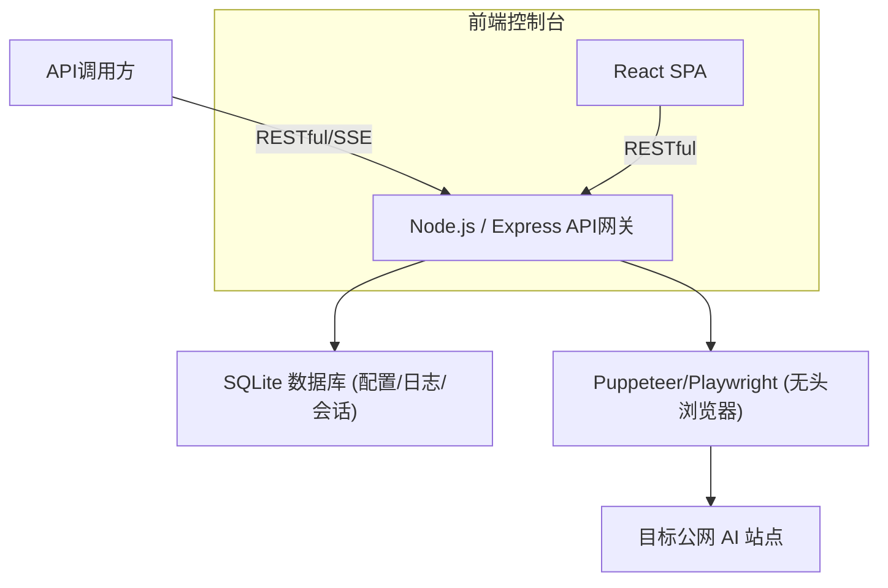
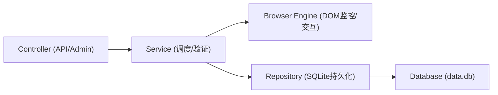
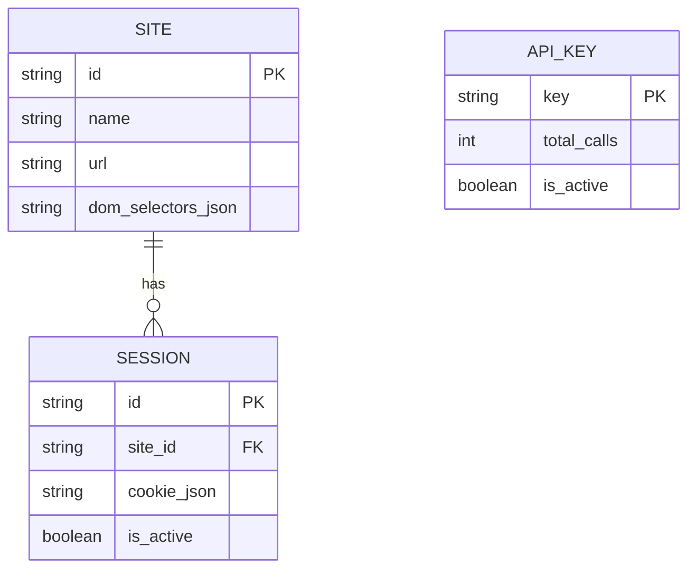

## 1. 架构设计


## 2. 技术说明
- **前端**: React@18 + TailwindCSS@3 + Vite (构建为纯静态文件，由后端代理，极低内存消耗)。
- **后端**: Node.js + Express/Hono。
- **数据库**: SQLite (本地单文件存储，免去MySQL/Redis的内存开销，完美契合1C1G服务器)。
- **无头浏览器**: Puppeteer (配置 `--no-sandbox`, `--disable-dev-shm-usage` 以及内存限制优化，单实例多Page复用，控制在1G内存内运行)。
- **进程管理**: PM2 或直接 Node 运行。

## 3. 路由定义 (前端)
| 路由 | 目的 |
|------|------|
| `/` | 控制台首页与数据看板 |
| `/sites` | 目标站点管理 |
| `/sessions` | 会话池（Cookies/Tokens）管理 |
| `/keys` | API Key与鉴权管理 |

## 4. API 定义 (后端)
```typescript
// OpenAI 兼容接口
POST /v1/chat/completions
Request: {
  model: string; // 对应目标站点ID或标识
  messages: Array<{role: string, content: string}>;
  stream?: boolean;
}
Response (SSE): data: {"id":"chatcmpl-123","object":"chat.completion.chunk","model":"...","choices":[{"delta":{"content":"Hello"}}]}

// 控制台管理接口
GET /api/admin/status
GET /api/admin/sites
POST /api/admin/sites
GET /api/admin/sessions
POST /api/admin/sessions
```

## 5. 服务端架构图


## 6. 数据模型
### 6.1 数据模型定义


### 6.2 数据库定义语言 (DDL)
```sql
CREATE TABLE sites (
    id TEXT PRIMARY KEY,
    name TEXT NOT NULL,
    url TEXT NOT NULL,
    dom_selectors_json TEXT NOT NULL
);

CREATE TABLE sessions (
    id TEXT PRIMARY KEY,
    site_id TEXT NOT NULL,
    cookie_json TEXT NOT NULL,
    is_active INTEGER DEFAULT 1,
    last_used_at DATETIME,
    FOREIGN KEY (site_id) REFERENCES sites(id)
);

CREATE TABLE api_keys (
    key TEXT PRIMARY KEY,
    total_calls INTEGER DEFAULT 0,
    is_active INTEGER DEFAULT 1
);
```