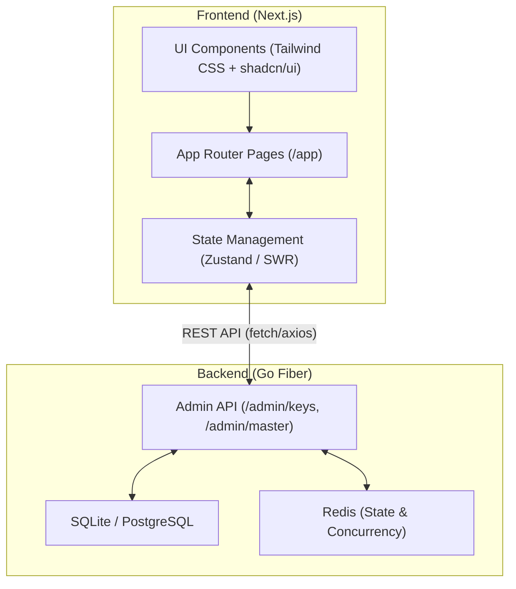

# 技术架构文档: Nvidia API Gateway Management Dashboard

## 1. 架构概览 (Architecture Overview)

本系统采用现代化的 B/S 架构，前端基于 React 生态最前沿的技术栈，并结合 Next.js App Router 模式，实现极致的页面渲染速度与开发者体验。前端负责纯粹的数据展示与用户交互，通过 HTTP API 与基于 Go 编写的 Nvidia API Gateway 管理端（`/admin` 路由组）进行通信。

## 2. 技术栈选型 (Technology Stack)

### 2.1 核心框架 (Core Framework)
- **Next.js (v14+)**: 利用最新的 App Router 特性，提供服务端渲染 (SSR) 和静态站点生成 (SSG) 能力，提升首屏加载速度并优化数据预取。
- **React (v18+)**: 利用并发渲染特性，确保在处理海量 API Key 状态更新时界面不卡顿。

### 2.2 样式与 UI 组件 (Styling & UI)
- **Tailwind CSS**: 原子化 CSS 框架，利用其 `JIT` 引擎，实现赛博工业风 (Cyber-Industrial) 中复杂的暗黑主题、几何线条和极简边框的快速构建。
- **shadcn/ui**: 作为基础 UI 组件库（如 Button, Input, Table, Modal），但不局限于其默认样式。我们将深度定制其底层 Tailwind 类，注入冰冷的金属质感与荧光色点缀，摒弃圆润的现代 Web 审美。
- **Lucide Icons**: 提供清晰、锐利的线条图标，匹配整体无废话的极客感。

### 2.3 状态管理与数据请求 (State & Data Fetching)
- **SWR (或 React Query)**: 负责与 Go 后端的数据同步。考虑到 API Key 的状态 (Active/Cooling/Dead) 可能会随时变化，利用 SWR 的轮询 (Polling) 和焦点重新验证 (Revalidate on Focus) 功能，确保管理员看到的数据永远是最新的。
- **Zustand**: (可选) 用于管理全局 UI 状态（如深色模式切换、全局错误通知等），比 Redux 更轻量，更符合极简主义的哲学。

### 2.4 其他关键依赖
- **framer-motion**: 用于实现极短、干脆的微动效（如模态框的机械式弹入、状态指示灯的呼吸/闪烁效果）。
- **clsx + tailwind-merge**: 用于在组件内部优雅地拼接和覆盖 Tailwind 类名。

## 3. 核心模块设计 (Core Modules Design)

### 3.1 数据概览模块 (Dashboard Module)
- **组件**: `StatsGrid`, `ConcurrencyChart`
- **职责**: 获取聚合后的统计数据（可用 Key 总数、已消耗 Token 总计、当前并发锁数量），并使用大字号、高对比度的方式呈现。
- **技术点**: 考虑使用轻量级的图表库（如 Recharts）展示 24 小时内的拦截/重试曲线，颜色采用深灰背景 + 荧光绿/红线条。

### 3.2 API 密钥池模块 (Key Pool Module)
- **组件**: `KeyTable`, `AddKeyModal`, `StatusBadge`
- **职责**: 
  - 列出所有的 Nvidia API Key。
  - 提供 "添加密钥" 功能，调用 Go 后端的 `POST /admin/keys` 接口。
- **技术点**: 
  - 表格设计需极其紧凑（Dense Padding），边框使用 1px 的 `#27272A`。
  - 状态徽章 (`StatusBadge`) 根据状态应用不同的 Tailwind 动画类（如 `animate-pulse` 用于 Cooling 状态）。

### 3.3 Master Key 授权模块 (Master Key Module)
- **组件**: `MasterKeyList`, `GenerateKeyModal`, `QuotaEditor`
- **职责**: 
  - 管理下发给客户端的 Master Key。
  - 设置和修改 RPM, TPM 和硬性 Quota。
- **技术点**: 使用复杂的表单验证，确保输入的配额数值合法。

## 4. API 接口对接规范 (API Integration)

前端将封装一个统一的 `apiClient`（基于 `fetch` 或 `axios`），并配置以下基础路径：
- `BASE_URL`: `http://localhost:8080/admin` (开发环境)

**已知接口定义 (Go 后端已实现/待实现部分)**:
- `GET /keys`: 获取 API Key 列表 (ID, Name, Weight, Status, CreatedAt)。
- `POST /keys`: 添加新的 API Key (Body: `{key, name, weight}`)。
- *(待补充)* `GET /master-keys`: 获取 Master Key 列表及配额使用情况。
- *(待补充)* `POST /master-keys`: 生成新的 Master Key 并设置 Quota。
- *(待补充)* `GET /stats`: 获取全局并发与请求统计信息。

## 5. 部署与交付 (Deployment & Delivery)
- 前端项目将作为一个独立的模块存放在 `/workspace/nvidia-api-gateway/frontend` 或单独的仓库中。
- 开发阶段使用 `npm run dev` 配合后端的 `go run main.go`。
- 生产环境将通过 `next build` 构建为静态文件，并由 Go Fiber 提供静态资源托管，或者部署在独立的 Vercel/Nginx 服务器上。
